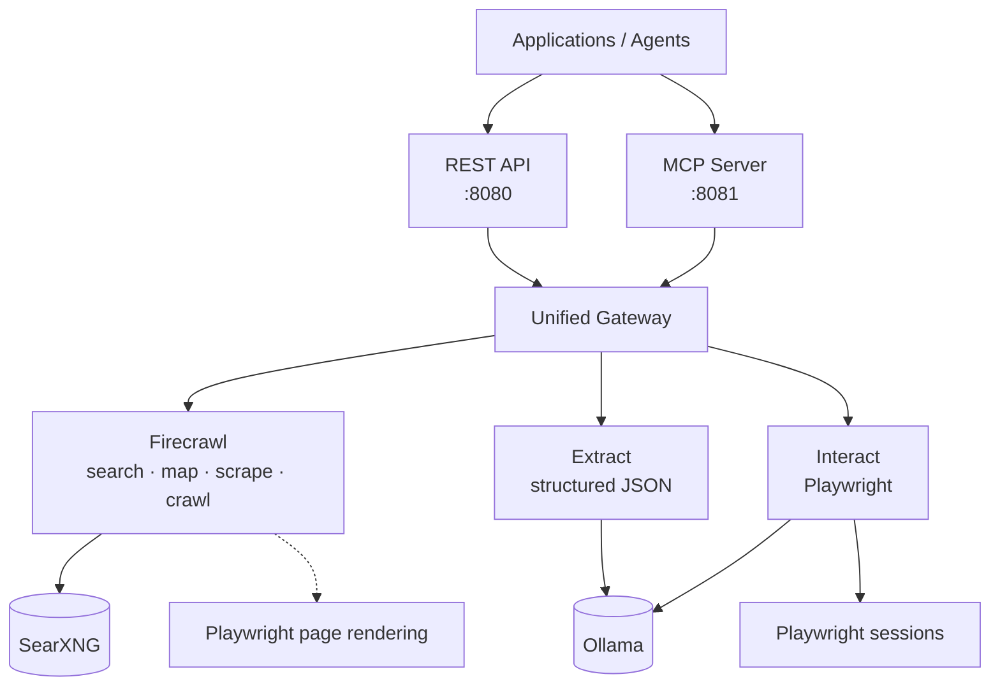
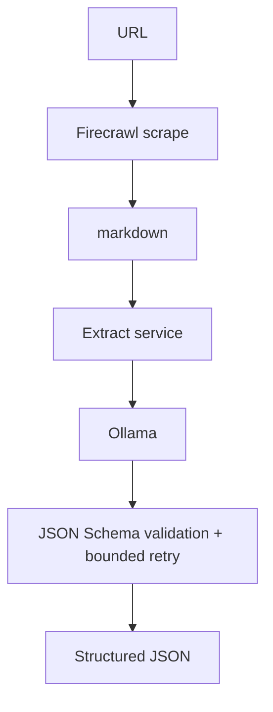
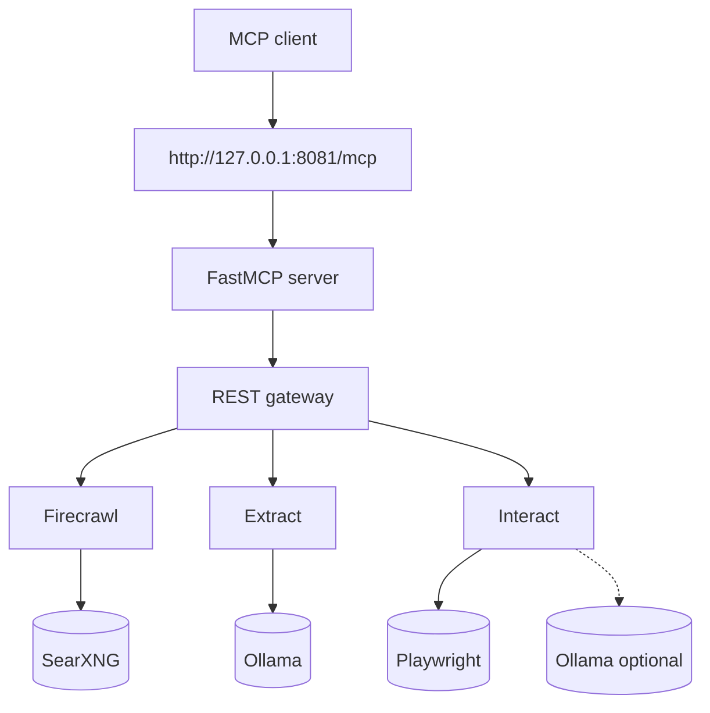
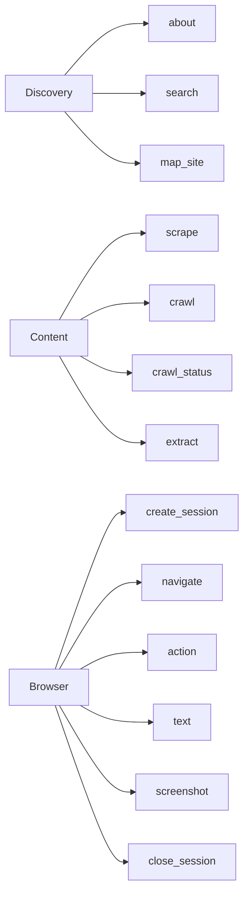
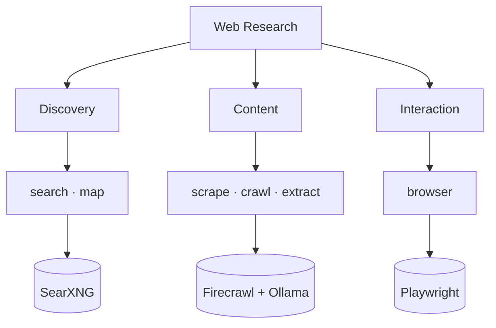

# Web Research

A self-hosted web research platform that exposes one stable set of web research endpoints (REST and MCP) for search, discovery, scraping, crawling, structured extraction, and browser interaction, plus a built-in Web UI for exercising all endpoints.

The stack deliberately combines several specialized services rather than trying to make one component do everything:

| Capability | Implementation |
|---|---|
| Search | Self-hosted Firecrawl using your existing SearXNG endpoint |
| Map | Self-hosted Firecrawl |
| Scrape | Self-hosted Firecrawl |
| Crawl | Self-hosted Firecrawl |
| Extract | Dedicated FastAPI service using your existing Ollama endpoint + JSON Schema validation |
| Interact | Dedicated Playwright browser-automation service, with optional Ollama selector resolution |
| REST | Unified FastAPI gateway on port `8080` |
| MCP | FastMCP server exposing the same capabilities on port `8081` |
| Test UI | Served by the gateway at `/ui` for manually testing REST and MCP endpoints |

> **Important:** this Compose project does **not** start Ollama or SearXNG. It is designed to reuse the Ollama and SearXNG instances you already run separately.

## Why did I build this?

The self-hosted version of Firecrawl provides excellent search, map, scrape, and crawl endpoints, but it does **not** support the `extract` or `interact` features that the cloud-hosted (paid) service offers. I wanted both capabilities without depending on a SaaS bill, so I added two dedicated services:

- **Extract:** a FastAPI service that calls my existing Ollama endpoint and validates the response against a caller-supplied JSON Schema, with bounded retry on invalid output.
- **Interact:** a Playwright browser-automation service for stateful navigation, clicking, typing, selecting, scrolling, reading text, and capturing screenshots.

I then wanted a single, stable API contract rather than maintaining two separate stacks, so the gateway exposes everything as **REST**, and the **MCP** server is a thin, stateful wrapper that routes the same calls through the same gateway. This means any improvement, bug fix, or new endpoint only needs to be added once.

## Architecture



External existing services:
- **Ollama** → `http://host.docker.internal:11434`
- **SearXNG** → `http://host.docker.internal:8088`

Firecrawl also runs its own internal Playwright service for page scraping. The `interact` service is separate and exists specifically for stateful browser automation such as navigating, clicking, typing, selecting, scrolling, reading page text, and taking screenshots.

## Design principles

- **One stable contract:** application code talks to the gateway rather than directly to Firecrawl, Ollama, or Playwright.
- **REST and MCP use the same backend logic:** the MCP server calls the REST gateway instead of duplicating implementation code.
- **External Ollama and SearXNG:** existing services are reused instead of creating duplicate containers.
- **Deterministic first:** browser interaction uses explicit selectors and accessible text before asking an LLM to resolve ambiguity.
- **Structured extraction:** Ollama output is validated against the caller's JSON Schema and retried when invalid.
- **Evidence preservation:** extract responses include source/provenance metadata.
- **Browser isolation:** each interact session receives its own Playwright browser context with a TTL.
- **SSRF controls:** browser navigation and subrequests reject private/internal destinations by default.
- **Conservative automation:** potentially consequential clicks are blocked unless explicitly allowed.
- **Private dependencies:** Redis, RabbitMQ, PostgreSQL, Firecrawl workers, and both Playwright services are not published to the host.

## Project layout

```text
web-research/
├── docker-compose.yaml
├── .env.example
├── .dockerignore
├── .gitignore
├── data/      # runtime bind mounts (gitignored)
├── Dockerfile.python
├── requirements.txt
├── Makefile
├── pytest.ini
├── common/
│   ├── http.py
│   └── logging.py
├── gateway/
│   └── app.py
├── extract/
│   └── app.py
├── interact/
│   ├── Dockerfile
│   ├── requirements.txt
│   ├── app.py
│   └── security.py
├── mcp/
│   └── server.py
├── ui/
│   └── index.html
├── scripts/
│   ├── lib.sh
│   ├── test-all.sh
│   ├── test-endpoints.sh
│   ├── test-functionality.sh
│   ├── test-mcp.sh
│   └── test-security.sh
├── tests/
│   ├── live_mcp.py
│   ├── test_http_security.py
│   └── test_security.py
└── .github/workflows/
    └── ci.yml
```

# Quick Start
## Prerequisites

You need:

- Docker Engine
- Docker Compose v2
- an existing Ollama service
- an existing SearXNG service with JSON output enabled
- at least one Ollama model suitable for structured JSON, such as `qwen2.5:14b`

This project assumes your existing services are reachable from Docker containers through host-published ports:

```text
Ollama:  http://host.docker.internal:11434
SearXNG: http://host.docker.internal:8088
```

On Linux, the Compose services that need these addresses include:

```yaml
extra_hosts:
  - "host.docker.internal:host-gateway"
```

That lets the Web Research use separate containers without requiring them to belong to the same Compose project or Docker network.

## Verify the existing services first

From the Docker host:

```bash
curl -sS http://127.0.0.1:11434/api/tags | jq
```

For SearXNG:

```bash
curl -sS 'http://127.0.0.1:8088/search?q=firecrawl&format=json' | jq '.results[:2]'
```

If either command fails, fix that service before starting this project.

## Configuration

Create the environment file:

```bash
cp .env.example .env
```

At minimum review these settings:

```dotenv
GATEWAY_API_KEY=replace-with-a-long-random-value
POSTGRES_PASSWORD=replace-this-postgres-password

OLLAMA_BASE_URL=http://host.docker.internal:11434
OLLAMA_MODEL=qwen2.5:14b

SEARXNG_ENDPOINT=http://host.docker.internal:8088
SEARXNG_ENGINES=
SEARXNG_CATEGORIES=general
```

`SEARXNG_ENDPOINT` is passed to Firecrawl, so `/v1/search` uses the SearXNG instance you already operate.

`OLLAMA_BASE_URL` is used directly by the dedicated `extract` service and by `interact` only when selector ambiguity requires LLM assistance.

The project does **not** create an `ollama` service or a `searxng` service in `docker-compose.yaml`.

## If Ollama or SearXNG use different ports

Simply change the environment values:

```dotenv
OLLAMA_BASE_URL=http://host.docker.internal:11435
SEARXNG_ENDPOINT=http://host.docker.internal:8888
```

## If you prefer container DNS names

If your existing services share an external Docker network with this project, you can instead use addresses such as:

```dotenv
OLLAMA_BASE_URL=http://ollama:11434
SEARXNG_ENDPOINT=http://searxng:8080
```

You must then attach the relevant Web Research containers to that external Docker network. The supplied configuration uses host-published ports because it keeps the projects independent and requires no shared-network naming convention.

## Firecrawl versioning

The example `.env` allows:

```dotenv
FIRECRAWL_VERSION=latest
```

That is convenient for an initial test, but production deployments should use an exact Firecrawl release or image digest you have tested.

Firecrawl's own self-hosting guidance recommends keeping the Compose configuration aligned with the release you deploy. Its internal service topology and environment variables can change across releases.

## Start the stack

Validate the Compose file first:

```bash
docker compose config
```

Build and start:

```bash
docker compose up -d --build
```

or:

```bash
make up
```

Inspect status:

```bash
docker compose ps
```

Follow logs:

```bash
docker compose logs -f --tail=200
```

The public interfaces are bound to loopback by default:

```text
REST API:    http://127.0.0.1:8080
OpenAPI UI:  http://127.0.0.1:8080/docs
MCP server:  http://127.0.0.1:8081/mcp
Web UI:      http://127.0.0.1:8080/ui  (test/exercise all endpoints; auth required to send requests)
```

## UI screenshots

The following placeholder images document the test UI once screenshots are captured. Replace the placeholder paths with the actual files.


_Figure 1: MCP tab with a session-aware step flow and the tool name / parameters form._


_Figure 2: Interact tab after pre-querying a URL for interactive elements._


_Figure 3: Plan tab with use-case buttons for Login and Search and an LLM-generated action plan._

# 5-minute REST example

The REST gateway is the preferred interface for conventional applications, Python services, LangGraph HTTP nodes, shell scripts, and integrations that already use HTTP APIs.

Set the gateway key once for shell examples:

```bash
export WRS_KEY='replace-with-your-GATEWAY_API_KEY'
export WRS='http://127.0.0.1:8080'
```

All gateway requests use:

```http
Authorization: Bearer <GATEWAY_API_KEY>
```

## REST endpoint summary

| Method | Endpoint | Purpose |
|---|---|---|
| `GET` | `/health` | Gateway health |
| `POST` | `/v1/search` | Search through Firecrawl + SearXNG |
| `POST` | `/v1/map` | Discover URLs on a site |
| `POST` | `/v1/scrape` | Scrape a single URL |
| `POST` | `/v1/crawl` | Start a crawl |
| `GET` | `/v1/crawl/{job_id}` | Check crawl status/results |
| `POST` | `/v1/extract` | Structured extraction through Ollama |
| `POST` | `/v1/interact/sessions` | Create browser session |
| `POST` | `/v1/interact/sessions/{id}/navigate` | Navigate browser |
| `POST` | `/v1/interact/sessions/{id}/action` | Click/type/press/select/wait/scroll |
| `GET` | `/v1/interact/sessions/{id}/text` | Read page text |
| `GET` | `/v1/interact/sessions/{id}/screenshot` | Capture PNG screenshot |
| `DELETE` | `/v1/interact/sessions/{id}` | Close browser session |

## Search

```bash
curl -sS "$WRS/v1/search" \
  -H "Authorization: Bearer $WRS_KEY" \
  -H 'Content-Type: application/json' \
  -d '{
    "query": "accessible hotels Vancouver BC",
    "limit": 5
  }' | jq
```

Flow:

```text
REST client -> Gateway -> Firecrawl /v2/search -> existing SearXNG
```

## Map a website

```bash
curl -sS "$WRS/v1/map" \
  -H "Authorization: Bearer $WRS_KEY" \
  -H 'Content-Type: application/json' \
  -d '{
    "url": "https://example.com",
    "limit": 100
  }' | jq
```

## Scrape a page

```bash
curl -sS "$WRS/v1/scrape" \
  -H "Authorization: Bearer $WRS_KEY" \
  -H 'Content-Type: application/json' \
  -d '{
    "url": "https://example.com",
    "formats": ["markdown"]
  }' | jq
```

## Start a crawl

```bash
curl -sS "$WRS/v1/crawl" \
  -H "Authorization: Bearer $WRS_KEY" \
  -H 'Content-Type: application/json' \
  -d '{
    "url": "https://example.com",
    "limit": 50
  }' | jq
```

Save the returned crawl job ID and poll it:

```bash
JOB_ID='<returned-job-id>'

curl -sS "$WRS/v1/crawl/$JOB_ID" \
  -H "Authorization: Bearer $WRS_KEY" | jq
```

## Extract structured data from a URL

The gateway first scrapes the page through Firecrawl and then sends the resulting content to the dedicated Ollama extraction service.



Example:

```bash
curl -sS "$WRS/v1/extract" \
  -H "Authorization: Bearer $WRS_KEY" \
  -H 'Content-Type: application/json' \
  -d '{
    "url": "https://example.com",
    "instruction": "Extract the page title and a short summary using only the supplied page content.",
    "schema": {
      "type": "object",
      "properties": {
        "title": {"type": ["string", "null"]},
        "summary": {"type": ["string", "null"]}
      },
      "required": ["title", "summary"],
      "additionalProperties": false
    }
  }' | jq
```

Typical response shape:

```json
{
  "data": {
    "title": "Example Domain",
    "summary": "..."
  },
  "provenance": {
    "source_url": "https://example.com",
    "content_sha256": "...",
    "content_chars": 1234,
    "truncated": false,
    "model": "qwen2.5:14b",
    "attempts": 1,
    "generated_at": "..."
  }
}
```

### Extract request fields

| Field | Required | Description |
|---|---|---|
| `url` | one of `url` or `content` | Page to scrape through Firecrawl before extraction. |
| `content` | one of `url` or `content` | Raw text or markdown to extract from directly, skipping the scrape step. |
| `instruction` | yes | Plain-language description of what to extract. Be specific. |
| `schema` | yes | JSON Schema describing the desired output shape. Use `additionalProperties: false` to keep the model focused. |
| `model` | no | Override the Ollama model for this call only. Defaults to `OLLAMA_MODEL` from `.env`. |
| `max_retries` | no | Maximum number of JSON Schema validation retries. Defaults to `EXTRACT_MAX_RETRIES` from `.env`. |

You can supply either `url` or `content`, but not both. The gateway checks for at least one.

### More extract examples

**Extract from supplied content**

```bash
curl -sS "$WRS/v1/extract" \
  -H "Authorization: Bearer $WRS_KEY" \
  -H 'Content-Type: application/json' \
  -d '{
    "content": "The Blue Bistro serves seafood on 123 Main St, Boston. Phone: 555-0100.",
    "instruction": "Extract the restaurant name, cuisine, street address, and phone number.",
    "schema": {
      "type": "object",
      "properties": {
        "name": {"type": "string"},
        "cuisine": {"type": "string"},
        "address": {"type": "string"},
        "phone": {"type": "string"}
      },
      "required": ["name", "cuisine", "address", "phone"],
      "additionalProperties": false
    }
  }' | jq
```

**Override the Ollama model for one call**

```bash
curl -sS "$WRS/v1/extract" \
  -H "Authorization: Bearer $WRS_KEY" \
  -H 'Content-Type: application/json' \
  -d '{
    "url": "https://example.com",
    "instruction": "Extract the page title and a short summary.",
    "model": "qwen2.5:14b",
    "max_retries": 2,
    "schema": {
      "type": "object",
      "properties": {
        "title": {"type": ["string", "null"]},
        "summary": {"type": ["string", "null"]}
      },
      "required": ["title", "summary"],
      "additionalProperties": false
    }
  }' | jq
```

## Extract from content you already have

This avoids an unnecessary scrape:

```bash
curl -sS "$WRS/v1/extract" \
  -H "Authorization: Bearer $WRS_KEY" \
  -H 'Content-Type: application/json' \
  -d '{
    "content": "Acme Inc. is headquartered in Vancouver, British Columbia.",
    "instruction": "Extract company and headquarters.",
    "schema": {
      "type": "object",
      "properties": {
        "company": {"type": ["string", "null"]},
        "headquarters": {"type": ["string", "null"]}
      },
      "required": ["company", "headquarters"],
      "additionalProperties": false
    }
  }' | jq
```

## Browser interaction

### Create a session

```bash
SESSION_ID=$(curl -sS "$WRS/v1/interact/sessions" \
  -X POST \
  -H "Authorization: Bearer $WRS_KEY" \
  -H 'Content-Type: application/json' \
  -d '{}' | jq -r '.session_id')

echo "$SESSION_ID"
```

### Navigate

```bash
curl -sS "$WRS/v1/interact/sessions/$SESSION_ID/navigate" \
  -H "Authorization: Bearer $WRS_KEY" \
  -H 'Content-Type: application/json' \
  -d '{"url":"https://example.com"}' | jq
```

### Click with an explicit selector

```bash
curl -sS "$WRS/v1/interact/sessions/$SESSION_ID/action" \
  -H "Authorization: Bearer $WRS_KEY" \
  -H 'Content-Type: application/json' \
  -d '{
    "action": "click",
    "selector": "a"
  }' | jq
```

### Type into a field

```bash
curl -sS "$WRS/v1/interact/sessions/$SESSION_ID/action" \
  -H "Authorization: Bearer $WRS_KEY" \
  -H 'Content-Type: application/json' \
  -d '{
    "action": "type",
    "selector": "input[name=q]",
    "value": "British Columbia"
  }' | jq
```

### Use a natural-language element description

When no CSS selector is supplied, the service first tries deterministic accessible-text and label matching. Ollama is used only when the target remains ambiguous.

```bash
curl -sS "$WRS/v1/interact/sessions/$SESSION_ID/action" \
  -H "Authorization: Bearer $WRS_KEY" \
  -H 'Content-Type: application/json' \
  -d '{
    "action": "click",
    "description": "Search"
  }' | jq
```

### Read page text

```bash
curl -sS "$WRS/v1/interact/sessions/$SESSION_ID/text" \
  -H "Authorization: Bearer $WRS_KEY" | jq
```

### Save a screenshot

```bash
curl -sS "$WRS/v1/interact/sessions/$SESSION_ID/screenshot" \
  -H "Authorization: Bearer $WRS_KEY" \
  -o screenshot.png
```

### Close the session

```bash
curl -sS "$WRS/v1/interact/sessions/$SESSION_ID" \
  -X DELETE \
  -H "Authorization: Bearer $WRS_KEY" | jq
```

## Scenario recipes and best practices

These recipes mirror the Firecrawl V1 recommendations through the gateway contract. Every example uses `Authorization: Bearer $WRS_KEY` and `Content-Type: application/json` for `POST` requests.

### Search and read the top results

Firecrawl returns search metadata by default. Ask for `scrapeOptions` with `markdown` to get full page content, and use `onlyMainContent: true` to skip navigation/footers.

```bash
curl -sS "$WRS/v1/search" \
  -H "Authorization: Bearer $WRS_KEY" \
  -H 'Content-Type: application/json' \
  -d '{
    "query": "Royal Caribbean Alaska 2027",
    "limit": 5,
    "scrapeOptions": {
      "formats": ["markdown"],
      "onlyMainContent": true
    }
  }' | jq
```

### Search with a time filter

Use `tbs` to limit results to a recent period (`qdr:w` = past week, `qdr:m` = past month).

```bash
curl -sS "$WRS/v1/search" \
  -H "Authorization: Bearer $WRS_KEY" \
  -H 'Content-Type: application/json' \
  -d '{
    "query": "NVIDIA stock news",
    "limit": 5,
    "tbs": "qdr:d",
    "scrapeOptions": {
      "formats": ["markdown"],
      "onlyMainContent": true
    }
  }' | jq
```

### Discover a site through its sitemap

`map` is the fastest way to get URLs. `sitemapOnly: true` returns only sitemap links, while `search` lets you target a topic.

```bash
curl -sS "$WRS/v1/map" \
  -H "Authorization: Bearer $WRS_KEY" \
  -H 'Content-Type: application/json' \
  -d '{
    "url": "https://www.princess.com",
    "limit": 100,
    "sitemapOnly": true,
    "includeSubdomains": false
  }' | jq
```

### Map a site for a topic

```bash
curl -sS "$WRS/v1/map" \
  -H "Authorization: Bearer $WRS_KEY" \
  -H 'Content-Type: application/json' \
  -d '{
    "url": "https://www.royalcaribbean.com",
    "search": "Alaska cruise",
    "limit": 50,
    "ignoreSitemap": false
  }' | jq
```

### Scrape a page with multiple formats

Request `markdown`, `links`, and `screenshot` at the same time. Always inspect `data.metadata.statusCode`; a gateway `200` does not guarantee the target page loaded cleanly.

```bash
curl -sS "$WRS/v1/scrape" \
  -H "Authorization: Bearer $WRS_KEY" \
  -H 'Content-Type: application/json' \
  -d '{
    "url": "https://www.princess.com",
    "formats": ["markdown", "links", "screenshot"],
    "onlyMainContent": true,
    "waitFor": 1000
  }' | jq '.data | {statusCode: .metadata.statusCode, markdown: .markdown[:200], links: .links[:5], screenshot: .screenshot}'
```

### Scrape a product page

Use the `product` format for deterministic product extraction on product pages.

```bash
curl -sS "$WRS/v1/scrape" \
  -H "Authorization: Bearer $WRS_KEY" \
  -H 'Content-Type: application/json' \
  -d '{
    "url": "https://example.com/product",
    "formats": ["product", "markdown"],
    "onlyMainContent": true
  }' | jq '.data.product'
```

### Scrape with custom headers

Send headers such as `Accept-Language` or a custom user-agent.

```bash
curl -sS "$WRS/v1/scrape" \
  -H "Authorization: Bearer $WRS_KEY" \
  -H 'Content-Type: application/json' \
  -d '{
    "url": "https://example.com",
    "formats": ["markdown"],
    "headers": {
      "Accept-Language": "fr-CA,fr;q=0.9",
      "User-Agent": "Mozilla/5.0 (compatible; ResearchBot/1.0)"
    }
  }' | jq
```

### Crawl a site with controlled depth and paths

Limit scope with `maxDepth`, `includePaths`, and `excludePaths`. Use `scrapeOptions` to keep the returned data small.

```bash
curl -sS "$WRS/v1/crawl" \
  -H "Authorization: Bearer $WRS_KEY" \
  -H 'Content-Type: application/json' \
  -d '{
    "url": "https://www.princess.com",
    "limit": 20,
    "maxDepth": 2,
    "includePaths": ["cruise.*"],
    "excludePaths": [".*/blog/.*"],
    "scrapeOptions": {
      "formats": ["markdown"],
      "onlyMainContent": true
    }
  }' | jq
```

### Crawl an entire domain

Set `crawlEntireDomain: true` to follow sibling and parent links, not just child paths.

```bash
curl -sS "$WRS/v1/crawl" \
  -H "Authorization: Bearer $WRS_KEY" \
  -H 'Content-Type: application/json' \
  -d '{
    "url": "https://example.com",
    "limit": 100,
    "crawlEntireDomain": true,
    "scrapeOptions": {
      "formats": ["markdown"],
      "onlyMainContent": true
    }
  }' | jq
```

### Crawl with a webhook

Receive `crawl.started`, `crawl.page`, `crawl.completed`, and `crawl.failed` events at your endpoint as the crawl progresses.

```bash
curl -sS "$WRS/v1/crawl" \
  -H "Authorization: Bearer $WRS_KEY" \
  -H 'Content-Type: application/json' \
  -d '{
    "url": "https://example.com",
    "limit": 50,
    "webhook": "https://your-app.example.com/webhooks/firecrawl",
    "scrapeOptions": {
      "formats": ["markdown"],
      "onlyMainContent": true
    }
  }' | jq
```

### Extract structured data from a URL

```bash
curl -sS "$WRS/v1/extract" \
  -H "Authorization: Bearer $WRS_KEY" \
  -H 'Content-Type: application/json' \
  -d '{
    "url": "https://www.princess.com",
    "instruction": "Extract the cruise line name, featured destinations, and a one-sentence tagline.",
    "max_retries": 2,
    "schema": {
      "type": "object",
      "properties": {
        "cruise_line": {"type": ["string", "null"]},
        "destinations": {"type": "array", "items": {"type": "string"}},
        "tagline": {"type": ["string", "null"]}
      },
      "required": ["cruise_line", "destinations", "tagline"],
      "additionalProperties": false
    }
  }' | jq
```

### Extract from already-scraped content

Skip the scrape by passing `content` directly.

```bash
curl -sS "$WRS/v1/extract" \
  -H "Authorization: Bearer $WRS_KEY" \
  -H 'Content-Type: application/json' \
  -d '{
    "content": "The Blue Bistro serves seafood on 123 Main St, Boston. Phone: 555-0100.",
    "instruction": "Extract the restaurant name, cuisine, street address, and phone number.",
    "schema": {
      "type": "object",
      "properties": {
        "name": {"type": "string"},
        "cuisine": {"type": "string"},
        "address": {"type": "string"},
        "phone": {"type": "string"}
      },
      "required": ["name", "cuisine", "address", "phone"],
      "additionalProperties": false
    }
  }' | jq
```

### Browser automation flow

Create, navigate, act, and close. Use explicit selectors or accessible text descriptions.

```bash
## Step 1: createSESSION_ID=$(curl -sS "$WRS/v1/interact/sessions" \
  -X POST \
  -H "Authorization: Bearer $WRS_KEY" \
  -H 'Content-Type: application/json' \
  -d '{}' | jq -r '.session_id')

## Step 2: navigatecurl -sS "$WRS/v1/interact/sessions/$SESSION_ID/navigate" \
  -H "Authorization: Bearer $WRS_KEY" \
  -H 'Content-Type: application/json' \
  -d '{"url": "https://www.princess.com", "wait_until": "networkidle"}' | jq

## Step 3: click a search linkcurl -sS "$WRS/v1/interact/sessions/$SESSION_ID/action" \
  -H "Authorization: Bearer $WRS_KEY" \
  -H 'Content-Type: application/json' \
  -d '{
    "action": "click",
    "selector": "text=Search"
  }' | jq

## Step 4: screenshotcurl -sS "$WRS/v1/interact/sessions/$SESSION_ID/screenshot" \
  -H "Authorization: Bearer $WRS_KEY" \
  -o screenshot.png

## Step 5: closecurl -sS "$WRS/v1/interact/sessions/$SESSION_ID" \
  -X DELETE \
  -H "Authorization: Bearer $WRS_KEY" | jq
```

### Consequential actions

The interact service blocks clicks that look consequential unless you explicitly set `allow_consequential: true`. An agent should only set this after user approval.

```bash
curl -sS "$WRS/v1/interact/sessions/$SESSION_ID/action" \
  -H "Authorization: Bearer $WRS_KEY" \
  -H 'Content-Type: application/json' \
  -d '{
    "action": "click",
    "selector": "text=Confirm booking",
    "allow_consequential": true
  }' | jq
```

### General best-practice notes

- `onlyMainContent: true` is the default in Firecrawl V1, so you usually get clean content without specifying it.
- For `scrape` and `crawl` responses, check `data.metadata.statusCode` after confirming `success: true`; HTTP `200` from the gateway means the call reached Firecrawl, but the target page may have returned an error.
- Combine `formats` arrays to fetch multiple outputs (e.g., `markdown` + `links` + `screenshot`) in one call.
- Use `map` to discover URLs before an expensive `crawl`.
- Use `extract` when you need a guaranteed JSON shape; use `scrape` with `json` or `product` formats for ad-hoc structured output.
- Keep `interact` sessions short-lived and always `DELETE` them when finished.

# 5-minute MCP example

The MCP server is an alternate interface over the **same REST gateway**. It does not maintain a second implementation of search, scrape, crawl, extract, or browser interaction.



The MCP endpoint uses **Streamable HTTP**:

```text
http://127.0.0.1:8081/mcp
```

Because the Compose file binds MCP to `127.0.0.1`, it is accessible only from the Docker host by default. This is intentional. If you expose MCP to another machine, put it behind TLS and authentication rather than simply changing the bind address.

## MCP tools

| Tool | Purpose |
|---|---|
| `about` | Describe the stack |
| `search` | Search through Firecrawl + SearXNG |
| `map_site` | Discover URLs on a site |
| `scrape` | Scrape a URL |
| `crawl` | Start a crawl |
| `crawl_status` | Poll crawl status/results |
| `extract` | Scrape + structured extraction through Ollama |
| `browser_create_session` | Create isolated browser session |
| `browser_navigate` | Navigate a browser session |
| `browser_action` | Click/type/press/select/wait/scroll |
| `browser_text` | Read page text |
| `browser_screenshot` | Return a PNG as base64 |
| `browser_close_session` | Destroy browser session |

## Use MCP from a FastMCP Python client

Install the client library in your calling environment:

```bash
pip install fastmcp
```

Example:

```python
import asyncio
from fastmcp import Client


async def main():
    async with Client("http://127.0.0.1:8081/mcp") as client:
        tools = await client.list_tools()
        print([tool.name for tool in tools])

        result = await client.call_tool(
            "search",
            {
                "query": "accessible hotels Vancouver BC",
                "limit": 5,
            },
        )
        print(result)


asyncio.run(main())
```

## MCP search example

Call tool:

```text
search
```

Arguments:

```json
{
  "query": "Royal Caribbean Alaska 2027",
  "limit": 10
}
```

This executes the same backend path as:

```text
POST /v1/search
```

## MCP scrape example

Tool:

```text
scrape
```

Arguments:

```json
{
  "url": "https://example.com",
  "formats": ["markdown"]
}
```

## MCP extract example

Tool:

```text
extract
```

Arguments:

```json
{
  "url": "https://example.com",
  "instruction": "Extract the page title and summary.",
  "schema": {
    "type": "object",
    "properties": {
      "title": {"type": ["string", "null"]},
      "summary": {"type": ["string", "null"]}
    },
    "required": ["title", "summary"],
    "additionalProperties": false
  }
}
```

## MCP browser example

Browser interaction is session based.

First call:

```text
browser_create_session
```

Save the returned `session_id`.

Then call:

```text
browser_navigate
```

with:

```json
{
  "session_id": "<session-id>",
  "url": "https://example.com"
}
```

Then an action:

```text
browser_action
```

```json
{
  "session_id": "<session-id>",
  "action": "click",
  "description": "More information"
}
```

Read page text:

```text
browser_text
```

```json
{
  "session_id": "<session-id>"
}
```

Finally:

```text
browser_close_session
```

```json
{
  "session_id": "<session-id>"
}
```

## Generic MCP client configuration

For MCP clients that accept a Streamable HTTP URL, configure the server URL as:

```text
http://127.0.0.1:8081/mcp
```

The exact client configuration syntax varies by application. The key point is that the client connects directly to that URL; it does **not** connect to Firecrawl itself.

# Security model

## Gateway API key

`GATEWAY_API_KEY` protects the REST gateway when set.

Generate one with:

```bash
openssl rand -hex 32
```

Do not commit `.env`.

## Network exposure

By default only these ports are published, both on loopback:

```text
127.0.0.1:8080 -> REST gateway
127.0.0.1:8081 -> MCP server
```

The following remain private to the Compose network:

- Firecrawl API
- Firecrawl Playwright service
- Extract service
- Interact service
- Redis
- RabbitMQ
- PostgreSQL

## SSRF protection

The interaction service validates top-level navigation and browser subrequests. Private, loopback, link-local, multicast, and other non-public destinations are rejected unless explicitly permitted by code/policy.

This matters because a browser automation service without SSRF controls can otherwise be used to probe internal services.

## Consequential actions

The interaction service applies a conservative text-based policy to clicks that appear consequential. A potentially consequential click returns an error unless the request explicitly sets:

```json
{
  "allow_consequential": true
}
```

An agent should set this only after the application has obtained explicit user approval for that action.

# Choosing REST vs MCP

Use **REST** when:

- calling from application code
- using deterministic LangGraph nodes
- integrating through FastAPI/httpx/curl
- you want explicit HTTP request/response control
- you want OpenAPI documentation

Use **MCP** when:

- an LLM or agent should discover tools dynamically
- using an MCP-capable client
- you want the model to choose among `search`, `scrape`, `extract`, and browser tools
- you want one tool server rather than hard-coded HTTP nodes

Both interfaces reach the same underlying services.

# LangGraph integration

For deterministic LangGraph nodes, point all web-research HTTP calls at:

```text
http://<docker-host>:8080
```

Do not let individual nodes depend directly on Firecrawl's URL. For example:

```text
search node   -> POST /v1/search
map node      -> POST /v1/map
scrape node   -> POST /v1/scrape
crawl node    -> POST /v1/crawl
extract node  -> POST /v1/extract
interact node -> /v1/interact/...
```

For an MCP-driven agent, connect the MCP client to:

```text
http://<docker-host>:8081/mcp
```

This separation lets you replace a backend later without rewriting the graph.

# Testing

The project includes both **unit/regression tests** and **live end-to-end test scripts**. The live tests exercise the actual running REST gateway, Firecrawl, external SearXNG, external Ollama, Playwright interaction service, and MCP server.

## Test prerequisites

Start the stack first:

```bash
docker compose up -d --build
```

The live shell tests require `curl`, `python3`, and Docker. They automatically read `GATEWAY_API_KEY` from `.env` when it is not already exported.

By default the end-to-end tests use:

```text
REST gateway:  http://127.0.0.1:8080
MCP endpoint:  http://127.0.0.1:8081/mcp
Public test URL: https://example.com
Search query:   example domain
```

Override them when needed:

```bash
GATEWAY_URL=http://127.0.0.1:8080 \
MCP_URL=http://127.0.0.1:8081/mcp \
TEST_URL=https://www.iana.org \
SEARCH_QUERY='IANA reserved domains' \
./scripts/test-all.sh
```

## Unit and regression tests

Run the Python tests in the project image:

```bash
make test-unit
```

This checks:

- loopback/private/link-local SSRF blocking
- rejection of non-HTTP URL schemes
- rejection of credentials embedded in URLs
- mixed public/private DNS resolution, which protects against DNS-rebinding-style destinations
- browser host allowlist enforcement
- consequential-action detection
- gateway API-key enforcement
- `x-request-id` generation and preservation

You can also use the shorter alias:

```bash
make test
```

## Live security tests

```bash
make test-security
```

or:

```bash
./scripts/test-security.sh
```

The live security test creates a real isolated Playwright session and verifies that these destinations are rejected through the public REST contract:

```text
127.0.0.1
10.0.0.0/8
192.168.0.0/16
169.254.169.254
file:// URLs
credential-bearing URLs
```

It also confirms that a bad gateway API key receives HTTP `401` when authentication is enabled, and that unknown browser-session IDs receive `404`. It then runs the unit security regression suite inside the gateway image.

## Live REST functionality tests

```bash
make test-functionality
```

or:

```bash
./scripts/test-functionality.sh
```

This performs actual end-to-end calls for:

| Test | Path exercised |
|---|---|
| Health | client -> REST gateway |
| Request ID | gateway middleware |
| Search | gateway -> Firecrawl -> external SearXNG |
| Map | gateway -> Firecrawl |
| Scrape | gateway -> Firecrawl -> Firecrawl Playwright |
| Crawl | gateway -> Firecrawl queue/workers |
| Extract | gateway -> Extract -> external Ollama -> JSON Schema validation |
| Browser create | gateway -> Interact -> Playwright |
| Browser navigate | Interact + SSRF guard -> public URL |
| Browser text | Playwright DOM extraction |
| Screenshot | Playwright PNG generation |
| Browser close | session cleanup |

The extraction test supplies content directly instead of scraping it first. This deliberately isolates the **Ollama extraction path** so a Firecrawl failure cannot hide an Ollama problem.

If you only want local/non-network functionality checks, skip the Firecrawl tests that require outbound Internet and SearXNG:

```bash
SKIP_NETWORK_TESTS=1 ./scripts/test-functionality.sh
```

## MCP smoke test

```bash
make test-mcp
```

or:

```bash
./scripts/test-mcp.sh
```

The script executes a FastMCP client from inside the running MCP container. It connects to the real Streamable HTTP endpoint, performs MCP initialization, lists tools, verifies that all expected tools are exposed, and calls the `about` tool.



## Live endpoint regression

A wider endpoint regression suite with multiple checks per endpoint is also available:

```bash
./scripts/test-endpoints.sh
```

To skip tests that require a working SearXNG endpoint:

```bash
SKIP_NETWORK_TESTS=1 ./scripts/test-endpoints.sh
```

## Run everything

```bash
make test-all
```

or:

```bash
./scripts/test-all.sh
```

A successful run ends with:

```text
ALL TESTS PASSED
```

These tests are intentionally kept separate: unit tests are fast and deterministic, while live tests prove that the deployed services and your existing Ollama/SearXNG endpoints actually work together.

# Operations and troubleshooting

## Gateway

```bash
curl -sS http://127.0.0.1:8080/health | jq
```

If you enabled `GATEWAY_API_KEY` and your middleware requires it for health in a future version, add the Authorization header.

## Verify Ollama from the extract container

```bash
docker compose exec extract python - <<'PY'
import urllib.request
print(urllib.request.urlopen('http://host.docker.internal:11434/api/tags', timeout=5).read()[:500])
PY
```

## Verify SearXNG from Firecrawl

```bash
docker compose exec firecrawl-api node -e \
  "fetch('http://host.docker.internal:8088/search?q=test&format=json').then(r=>{console.log(r.status);return r.text()}).then(t=>console.log(t.slice(0,500))).catch(e=>{console.error(e);process.exit(1)})"
```

## Search returns no results

Check SearXNG directly:

```bash
curl -sS 'http://127.0.0.1:8088/search?q=test&format=json' | jq '.results | length'
```

Then inspect Firecrawl logs:

```bash
docker compose logs --tail=200 firecrawl-api
```

Confirm:

```bash
docker compose exec firecrawl-api env | grep '^SEARXNG_'
```

## Extraction fails

Confirm Ollama sees the model:

```bash
curl -sS http://127.0.0.1:11434/api/tags | jq -r '.models[].name'
```

Then:

```bash
docker compose logs --tail=200 extract
```

## Browser fails to start

```bash
docker compose logs --tail=200 interact
```

The interact container uses a Playwright image/runtime and a `1gb` shared-memory allocation.

## Request correlation

The gateway creates/preserves an `x-request-id` and forwards it to downstream services. Use that identifier when correlating gateway, extract, and interact logs.

# Production recommendations

Before exposing the stack outside a trusted host/network:

1. Pin Firecrawl and base image versions.
2. Put REST and MCP behind a TLS reverse proxy.
3. Add strong authentication at the reverse proxy/MCP boundary.
4. Keep Redis, RabbitMQ, PostgreSQL, Playwright, Extract, and Firecrawl internal.
5. Add resource limits appropriate to your hardware.
6. Back up persistent Firecrawl state.
7. Add log aggregation and metrics.
8. Define browser-session concurrency based on RAM/CPU capacity.
9. Keep the Interact service's SSRF restrictions enabled.
10. Do not allow an agent to set `allow_consequential=true` without explicit authorization.
11. Test upgrades in a staging Compose project before changing production.
12. Keep Ollama and SearXNG independently managed so this stack can be upgraded without replacing them.

# Capability summary

Once running, you have a single self-hosted web-research layer with both REST and MCP access:



Application code can therefore depend on the **Web Research contract** rather than directly on Firecrawl, SearXNG, Ollama, or Playwright.
