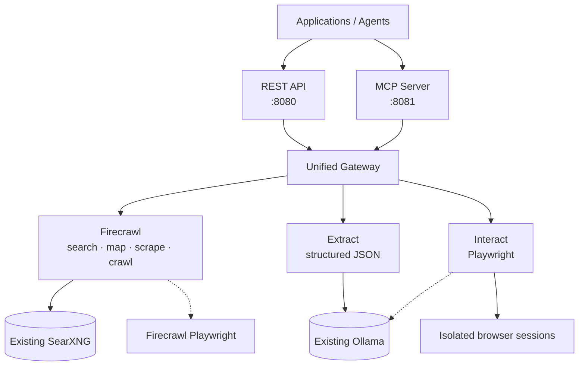
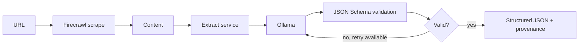
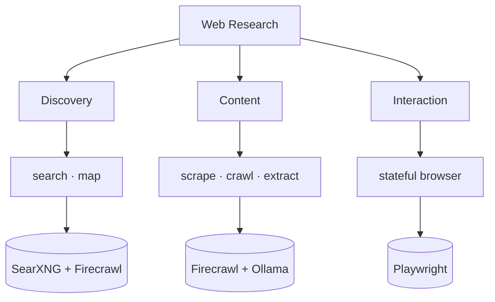

# Web Research

A self-hosted web research platform that exposes one stable set of
**REST** and **MCP** interfaces for search, site discovery, scraping,
crawling, structured extraction, and stateful browser interaction.

The project combines specialized services rather than forcing one
component to do everything:

  -----------------------------------------------------------------------
  Capability                          Implementation
  ----------------------------------- -----------------------------------
  Search                              Self-hosted Firecrawl using an
                                      existing SearXNG endpoint

  Map                                 Self-hosted Firecrawl

  Scrape                              Self-hosted Firecrawl

  Crawl                               Self-hosted Firecrawl

  Extract                             Dedicated FastAPI service using an
                                      existing Ollama endpoint + JSON
                                      Schema validation

  Interact                            Dedicated Playwright
                                      browser-automation service, with
                                      optional Ollama selector resolution

  REST                                Unified FastAPI gateway on port
                                      `8080`

  MCP                                 FastMCP server exposing the same
                                      capabilities on port `8081`

  Test UI                             Served by the gateway at `/ui` for
                                      manually exercising the platform

  MCP Console UI                      Served by the gateway at
                                      `/ui/mcp` for running MCP tools and
                                      building / executing workflows
  -----------------------------------------------------------------------

> **Important:** this Compose project does **not** start Ollama or
> SearXNG. It is designed to reuse Ollama and SearXNG instances that are
> already running separately.

## Contents

-   [Why I built this](#why-i-built-this)
-   [Architecture](#architecture)
-   [Design principles](#design-principles)
-   [Project layout](#project-layout)
-   [Quick Start](#quick-start)
-   [Web UI](#web-ui)
-   [REST API](#rest-api)
-   [MCP](#mcp)
-   [Choosing REST vs MCP](#choosing-rest-vs-mcp)
-   [LangGraph integration](#langgraph-integration)
-   [Security](#security)
-   [Testing](#testing)
-   [Operations and troubleshooting](#operations-and-troubleshooting)
-   [Production recommendations](#production-recommendations)
-   [Capability summary](#capability-summary)

## Why I built this

Self-hosted Firecrawl provides strong search, map, scrape, and crawl
primitives. I wanted to add two capabilities to my self-hosted research
environment without making application code depend directly on multiple
backends:

-   **Extract** --- structured extraction through an existing Ollama
    service, validated against a caller-supplied JSON Schema with
    bounded retry.
-   **Interact** --- stateful browser automation through Playwright for
    navigation, clicking, typing, selecting, scrolling, reading page
    text, and screenshots.

A unified gateway then exposes the complete capability set as REST. A
FastMCP server exposes the same backend capabilities to MCP clients and
agents. The result is a stable **Web Research contract** — application
code does not need to know which backend implements each
capability.

## Architecture



Default external-service addresses:

``` text
Ollama:  http://host.docker.internal:11434
SearXNG: http://host.docker.internal:8088
```

Firecrawl also runs its own internal Playwright service for page
rendering during scraping. The separate `interact` service exists
specifically for **stateful browser automation**.

## Design principles

-   **One stable contract** --- callers use Web Research rather than
    directly coupling to Firecrawl, Ollama, SearXNG, or Playwright.
-   **REST and MCP share backend behavior** --- MCP delegates through
    the gateway rather than duplicating the implementation.
-   **Reuse existing infrastructure** --- Ollama and SearXNG remain
    independently managed services.
-   **Deterministic first** --- browser interaction prefers explicit
    selectors and accessible text before using an LLM to resolve
    ambiguity.
-   **Structured extraction** --- Ollama output is validated against
    caller-supplied JSON Schema.
-   **Evidence preservation** --- extraction responses include
    provenance metadata.
-   **Browser isolation** --- each interaction session receives an
    isolated Playwright browser context with a TTL.
-   **Network containment** --- browser navigation and subrequests are
    checked against SSRF policy; private/internal destinations are
    rejected by default.
-   **Conservative automation** --- potentially consequential **clicks**
    are blocked unless the caller explicitly allows them.
-   **Private dependencies** --- Firecrawl workers, Redis, RabbitMQ,
    PostgreSQL, Extract, Interact, and Playwright services are not
    published to the host.
-   **Reproducible infrastructure** --- third-party container images are
    pinned to tested immutable digests in `docker-compose.yaml`.

## Project layout

``` text
web-research/
├── docker-compose.yaml
├── .env.example
├── .dockerignore
├── .gitignore
├── Dockerfile.python
├── requirements.txt
├── Makefile
├── pytest.ini
├── common/
│   ├── http.py
│   └── logging.py
├── gateway/
│   └── app.py
├── extract/
│   └── app.py
├── interact/
│   ├── Dockerfile
│   ├── requirements.txt
│   ├── app.py
│   └── security.py
├── mcp/
│   └── server.py
├── mcp_ui/
│   ├── app.py
│   └── index.html
├── ui/
│   └── index.html
├── scripts/
│   ├── lib.sh
│   ├── test-all.sh
│   ├── test-endpoints.sh
│   ├── test-functionality.sh
│   ├── test-mcp.sh
│   └── test-security.sh
├── tests/
│   ├── live_mcp.py
│   ├── test_http_security.py
│   └── test_security.py
```

Runtime data is stored under `data/` and is excluded from Git.

# Quick Start

## Prerequisites

You need:

-   Docker Engine
-   Docker Compose v2
-   `curl`
-   `jq` for the shell examples
-   an existing Ollama service
-   an existing SearXNG service with JSON output enabled
-   at least one Ollama model suitable for structured JSON, such as
    `qwen2.5:14b`

The default configuration assumes the existing services are reachable
from Docker containers through host-published ports:

``` text
Ollama:  http://host.docker.internal:11434
SearXNG: http://host.docker.internal:8088
```

On Linux, services that need host access use:

``` yaml
extra_hosts:
  - "host.docker.internal:host-gateway"
```

This keeps Web Research independent of the Compose projects that run
Ollama and SearXNG.

## Verify existing services

From the Docker host, verify Ollama:

``` bash
curl -sS http://127.0.0.1:11434/api/tags | jq
```

Verify SearXNG:

``` bash
curl -sS 'http://127.0.0.1:8088/search?q=firecrawl&format=json' \
  | jq '.results[:2]'
```

If either fails, fix that service before starting Web Research.

## Configure

Create the environment file:

``` bash
cp .env.example .env
```

Generate a gateway key:

``` bash
openssl rand -hex 32
```

At minimum, review:

``` dotenv
GATEWAY_API_KEY=replace-with-a-long-random-value
POSTGRES_PASSWORD=replace-this-postgres-password

OLLAMA_BASE_URL=http://host.docker.internal:11434
OLLAMA_MODEL=qwen2.5:14b

SEARXNG_ENDPOINT=http://host.docker.internal:8088
SEARXNG_ENGINES=
SEARXNG_CATEGORIES=general
```

`SEARXNG_ENDPOINT` is passed to Firecrawl, so `/v1/search` uses the
SearXNG instance you already operate.

`OLLAMA_BASE_URL` is used by the dedicated Extract service and by
Interact only when selector ambiguity requires LLM assistance.

> Keep `GATEWAY_API_KEY` configured for normal use. If the
> implementation permits a blank key, treat that only as an explicitly
> trusted-host/development mode. Do not expose an unauthenticated
> gateway to a LAN, tunnel, reverse proxy, or public network.

Do not commit `.env`.

### Different Ollama or SearXNG ports

Change only the environment values:

``` dotenv
OLLAMA_BASE_URL=http://host.docker.internal:11435
SEARXNG_ENDPOINT=http://host.docker.internal:8888
```

### Use Docker DNS instead

If the existing services share an external Docker network with this
project, addresses can instead look like:

``` dotenv
OLLAMA_BASE_URL=http://ollama:11434
SEARXNG_ENDPOINT=http://searxng:8080
```

Attach the relevant Web Research containers to that external network.
The supplied configuration uses host-published ports to keep the
projects independent.

## Image versioning

`docker-compose.yaml` pins Firecrawl and supporting third-party
infrastructure images to tested immutable image digests.

Example:

``` yaml
image: ghcr.io/firecrawl/firecrawl@sha256:<tested-digest>
```

Do not casually replace pinned digests with `latest` in a production
deployment. Test upgrades first, update the digest deliberately, then
run the complete regression suite.

## Start

Validate Compose:

``` bash
docker compose config
```

Build and start:

``` bash
docker compose up -d --build
```

or:

``` bash
make up
```

Check status:

``` bash
docker compose ps
```

Follow logs:

``` bash
docker compose logs -f --tail=200
```

Default interfaces:

``` text
REST API:    http://127.0.0.1:8080
OpenAPI UI:  http://127.0.0.1:8080/docs
MCP server:  http://127.0.0.1:8081/mcp
Web UI:      http://127.0.0.1:8080/ui
MCP Console: http://127.0.0.1:8080/ui/mcp
```

The published interfaces bind to loopback by default.

# Web UI

Two browser UIs are included for development, testing, and manually
exercising the platform. They do not replace the REST or MCP
interfaces, and they link to each other via the nav tabs at the top of
each page.

## Endpoint Tester

Served by the gateway at `/ui`. It provides a tab per endpoint (Search,
Map, Scrape, Crawl, Extract, Interact) with schema-driven parameter
controls, a built JSON body you can edit, and a submit step.

``` text
http://127.0.0.1:8080/ui
```

## MCP Console

Served by the gateway at `/ui/mcp`. It connects to the MCP
server, lists the available tools, renders each tool's parameters from
its input schema, and lets you run a tool once or assemble a multi-step
workflow (with `{{lastData.*}}` placeholders between steps) and execute
or export it as JSON.

``` text
http://127.0.0.1:8080/ui/mcp
```

When authentication is enabled, supply the configured gateway API key in
the Endpoint Tester. The MCP Console injects the key server-side for its
proxied requests, so it does not need to embed the secret into the page.

## UI screenshots

> **Screenshots intentionally pending.** The UI is still being refined.
> These paths are reserved so the final screenshots can be added without
> restructuring the README.


*Figure 1: MCP tab with the session-aware initialize, list-tools, and
call-tool flow.*


*Figure 2: Interact tab showing a stateful browser session and
discovered interactive elements.*


*Figure 3: Interact Plan tab showing a natural-language goal and
generated browser-action plan.*

# REST API

Use REST for conventional applications, deterministic LangGraph nodes,
shell scripts, and integrations that already use HTTP APIs.

Set the base URL and key once:

``` bash
export WRS='http://127.0.0.1:8080'
export WRS_KEY='replace-with-your-GATEWAY_API_KEY'
```

Authenticated requests use:

``` http
Authorization: Bearer <GATEWAY_API_KEY>
```

Interactive OpenAPI documentation is available at:

``` text
http://127.0.0.1:8080/docs
```

## Endpoint summary

  -------------------------------------------------------------------------------------------------------
  Method                  Endpoint                                  Purpose
  ----------------------- ----------------------------------------- -------------------------------------
  `GET`                   `/health`                                 Gateway/dependency health

  `POST`                  `/v1/search`                              Search through Firecrawl + SearXNG

  `POST`                  `/v1/map`                                 Discover URLs on a site

  `POST`                  `/v1/scrape`                              Scrape a single URL

  `POST`                  `/v1/crawl`                               Start a crawl

  `GET`                   `/v1/crawl/{job_id}`                      Check crawl status/results

  `POST`                  `/v1/extract`                             Structured extraction through Ollama

  `POST`                  `/v1/interact/sessions`                   Create a browser session

  `POST`                  `/v1/interact/sessions/{id}/navigate`     Navigate a browser session

  `POST`                  `/v1/interact/sessions/{id}/action`       Click/type/press/select/wait/scroll

  `GET`                   `/v1/interact/sessions/{id}/text`         Read page text

  `GET`                   `/v1/interact/sessions/{id}/screenshot`   Capture a PNG screenshot

  `DELETE`                `/v1/interact/sessions/{id}`              Close a browser session
  -------------------------------------------------------------------------------------------------------

## Search

``` bash
curl -sS "$WRS/v1/search" \
  -H "Authorization: Bearer $WRS_KEY" \
  -H 'Content-Type: application/json' \
  -d '{
    "query": "accessible hotels Vancouver BC",
    "limit": 5
  }' | jq
```

Flow:

``` text
REST client -> Gateway -> Firecrawl -> existing SearXNG
```

Search and scrape result content in one request:

``` bash
curl -sS "$WRS/v1/search" \
  -H "Authorization: Bearer $WRS_KEY" \
  -H 'Content-Type: application/json' \
  -d '{
    "query": "Royal Caribbean Alaska 2027",
    "limit": 5,
    "scrapeOptions": {
      "formats": ["markdown"],
      "onlyMainContent": true
    }
  }' | jq
```

## Map a site

``` bash
curl -sS "$WRS/v1/map" \
  -H "Authorization: Bearer $WRS_KEY" \
  -H 'Content-Type: application/json' \
  -d '{
    "url": "https://example.com",
    "limit": 100
  }' | jq
```

Target a topic:

``` bash
curl -sS "$WRS/v1/map" \
  -H "Authorization: Bearer $WRS_KEY" \
  -H 'Content-Type: application/json' \
  -d '{
    "url": "https://www.royalcaribbean.com",
    "search": "Alaska cruise",
    "limit": 50
  }' | jq
```

## Scrape

``` bash
curl -sS "$WRS/v1/scrape" \
  -H "Authorization: Bearer $WRS_KEY" \
  -H 'Content-Type: application/json' \
  -d '{
    "url": "https://example.com",
    "formats": ["markdown"],
    "onlyMainContent": true
  }' | jq
```

Multiple formats can be requested when supported by the pinned Firecrawl
release:

``` bash
curl -sS "$WRS/v1/scrape" \
  -H "Authorization: Bearer $WRS_KEY" \
  -H 'Content-Type: application/json' \
  -d '{
    "url": "https://example.com",
    "formats": ["markdown", "links", "screenshot"],
    "onlyMainContent": true,
    "waitFor": 1000
  }' | jq
```

Inspect target-page metadata as well as the gateway HTTP status; a
successful gateway request does not necessarily mean the target site
returned useful content.

## Crawl

Start:

``` bash
curl -sS "$WRS/v1/crawl" \
  -H "Authorization: Bearer $WRS_KEY" \
  -H 'Content-Type: application/json' \
  -d '{
    "url": "https://example.com",
    "limit": 50
  }' | jq
```

Poll:

``` bash
JOB_ID='<returned-job-id>'

curl -sS "$WRS/v1/crawl/$JOB_ID" \
  -H "Authorization: Bearer $WRS_KEY" | jq
```

Limit crawl scope where appropriate:

``` bash
curl -sS "$WRS/v1/crawl" \
  -H "Authorization: Bearer $WRS_KEY" \
  -H 'Content-Type: application/json' \
  -d '{
    "url": "https://example.com",
    "limit": 20,
    "maxDepth": 2,
    "scrapeOptions": {
      "formats": ["markdown"],
      "onlyMainContent": true
    }
  }' | jq
```

## Structured extraction

The gateway can scrape a URL and send the resulting content to the
dedicated Ollama extraction service:



Example:

``` bash
curl -sS "$WRS/v1/extract" \
  -H "Authorization: Bearer $WRS_KEY" \
  -H 'Content-Type: application/json' \
  -d '{
    "url": "https://example.com",
    "instruction": "Extract the page title and a short summary using only the supplied page content.",
    "schema": {
      "type": "object",
      "properties": {
        "title": {"type": ["string", "null"]},
        "summary": {"type": ["string", "null"]}
      },
      "required": ["title", "summary"],
      "additionalProperties": false
    }
  }' | jq
```

Typical response:

``` json
{
  "data": {
    "title": "Example Domain",
    "summary": "..."
  },
  "provenance": {
    "source_url": "https://example.com",
    "content_sha256": "...",
    "content_chars": 1234,
    "truncated": false,
    "model": "qwen2.5:14b",
    "attempts": 1,
    "generated_at": "..."
  }
}
```

### Extract request fields

  -----------------------------------------------------------------------
  Field                   Required                Description
  ----------------------- ----------------------- -----------------------
  `url`                   one of `url` or         Page to scrape before
                          `content`               extraction

  `content`               one of `url` or         Raw text/markdown to
                          `content`               extract directly

  `instruction`           yes                     What to extract; be
                                                  explicit

  `schema`                yes                     JSON Schema for the
                                                  required output

  `model`                 no                      Override `OLLAMA_MODEL`
                                                  for this request

  `max_retries`           no                      Override the configured
                                                  validation retry count
  -----------------------------------------------------------------------

Use `additionalProperties: false` when you want tightly constrained
output.

### Extract content you already have

``` bash
curl -sS "$WRS/v1/extract" \
  -H "Authorization: Bearer $WRS_KEY" \
  -H 'Content-Type: application/json' \
  -d '{
    "content": "Acme Inc. is headquartered in Vancouver, British Columbia.",
    "instruction": "Extract company and headquarters.",
    "schema": {
      "type": "object",
      "properties": {
        "company": {"type": ["string", "null"]},
        "headquarters": {"type": ["string", "null"]}
      },
      "required": ["company", "headquarters"],
      "additionalProperties": false
    }
  }' | jq
```

This avoids an unnecessary scrape.

## Browser interaction

Browser automation is session based.

### Create a session

``` bash
SESSION_ID=$(curl -sS "$WRS/v1/interact/sessions" \
  -X POST \
  -H "Authorization: Bearer $WRS_KEY" \
  -H 'Content-Type: application/json' \
  -d '{}' | jq -r '.session_id')

echo "$SESSION_ID"
```

### Navigate

``` bash
curl -sS "$WRS/v1/interact/sessions/$SESSION_ID/navigate" \
  -H "Authorization: Bearer $WRS_KEY" \
  -H 'Content-Type: application/json' \
  -d '{"url":"https://example.com"}' | jq
```

### Click

Prefer explicit selectors when you know them:

``` bash
curl -sS "$WRS/v1/interact/sessions/$SESSION_ID/action" \
  -H "Authorization: Bearer $WRS_KEY" \
  -H 'Content-Type: application/json' \
  -d '{
    "action": "click",
    "selector": "a"
  }' | jq
```

When a selector is not known, a natural-language description can be
used:

``` bash
curl -sS "$WRS/v1/interact/sessions/$SESSION_ID/action" \
  -H "Authorization: Bearer $WRS_KEY" \
  -H 'Content-Type: application/json' \
  -d '{
    "action": "click",
    "description": "Search"
  }' | jq
```

Interact tries deterministic accessible-text/label matching first.
Ollama is used only when the target remains ambiguous.

### Type

``` bash
curl -sS "$WRS/v1/interact/sessions/$SESSION_ID/action" \
  -H "Authorization: Bearer $WRS_KEY" \
  -H 'Content-Type: application/json' \
  -d '{
    "action": "type",
    "selector": "input[name=q]",
    "value": "British Columbia"
  }' | jq
```

### Read page text

``` bash
curl -sS "$WRS/v1/interact/sessions/$SESSION_ID/text" \
  -H "Authorization: Bearer $WRS_KEY" | jq
```

### Screenshot

``` bash
curl -sS "$WRS/v1/interact/sessions/$SESSION_ID/screenshot" \
  -H "Authorization: Bearer $WRS_KEY" \
  -o screenshot.png
```

### Close

``` bash
curl -sS "$WRS/v1/interact/sessions/$SESSION_ID" \
  -X DELETE \
  -H "Authorization: Bearer $WRS_KEY" | jq
```

### Complete browser flow

``` bash
# 1. Create a session.
SESSION_ID=$(curl -sS "$WRS/v1/interact/sessions" \
  -X POST \
  -H "Authorization: Bearer $WRS_KEY" \
  -H 'Content-Type: application/json' \
  -d '{}' | jq -r '.session_id')

# 2. Navigate.
curl -sS "$WRS/v1/interact/sessions/$SESSION_ID/navigate" \
  -H "Authorization: Bearer $WRS_KEY" \
  -H 'Content-Type: application/json' \
  -d '{"url":"https://example.com","wait_until":"networkidle"}' | jq

# 3. Read the page.
curl -sS "$WRS/v1/interact/sessions/$SESSION_ID/text" \
  -H "Authorization: Bearer $WRS_KEY" | jq

# 4. Capture a screenshot.
curl -sS "$WRS/v1/interact/sessions/$SESSION_ID/screenshot" \
  -H "Authorization: Bearer $WRS_KEY" \
  -o screenshot.png

# 5. Close the session.
curl -sS "$WRS/v1/interact/sessions/$SESSION_ID" \
  -X DELETE \
  -H "Authorization: Bearer $WRS_KEY" | jq
```

### Consequential clicks

The Interact service applies a conservative policy to **clicks** whose
target text appears consequential. A protected click requires:

``` json
{
  "allow_consequential": true
}
```

Example:

``` bash
curl -sS "$WRS/v1/interact/sessions/$SESSION_ID/action" \
  -H "Authorization: Bearer $WRS_KEY" \
  -H 'Content-Type: application/json' \
  -d '{
    "action": "click",
    "selector": "text=Confirm booking",
    "allow_consequential": true
  }' | jq
```

This is a guardrail for clicks, **not a complete authorization system
for every possible browser side effect**. Applications and agents remain
responsible for obtaining explicit user authorization before
consequential actions.

# MCP

The MCP server exposes Web Research capabilities to MCP-capable clients
over **Streamable HTTP**.

Endpoint:

``` text
http://127.0.0.1:8081/mcp
```

The MCP server delegates to the same REST gateway used by conventional
clients. It does not maintain a separate implementation of search,
scrape, extraction, or browser logic.

## MCP tools

  Tool                       Purpose
  -------------------------- --------------------------------------
  `about`                    Describe the stack
  `search`                   Search through Firecrawl + SearXNG
  `map_site`                 Discover URLs on a site
  `scrape`                   Scrape a URL
  `crawl`                    Start a crawl
  `crawl_status`             Poll crawl status/results
  `extract`                  Structured extraction through Ollama
  `browser_create_session`   Create an isolated browser session
  `browser_navigate`         Navigate a browser session
  `browser_action`           Click/type/press/select/wait/scroll
  `browser_text`             Read page text
  `browser_screenshot`       Return a screenshot
  `browser_close_session`    Destroy a browser session

## FastMCP Python client

Install:

``` bash
pip install fastmcp
```

Example:

``` python
import asyncio
from fastmcp import Client


async def main():
    async with Client("http://127.0.0.1:8081/mcp") as client:
        tools = await client.list_tools()
        print([tool.name for tool in tools])

        result = await client.call_tool(
            "search",
            {
                "query": "accessible hotels Vancouver BC",
                "limit": 5,
            },
        )
        print(result)


asyncio.run(main())
```

## MCP examples

### Search

Tool:

``` text
search
```

Arguments:

``` json
{
  "query": "Royal Caribbean Alaska 2027",
  "limit": 10
}
```

This reaches the same backend path as:

``` text
POST /v1/search
```

### Scrape

Tool:

``` text
scrape
```

Arguments:

``` json
{
  "url": "https://example.com",
  "formats": ["markdown"]
}
```

### Extract

Tool:

``` text
extract
```

Arguments:

``` json
{
  "url": "https://example.com",
  "instruction": "Extract the page title and summary.",
  "schema": {
    "type": "object",
    "properties": {
      "title": {"type": ["string", "null"]},
      "summary": {"type": ["string", "null"]}
    },
    "required": ["title", "summary"],
    "additionalProperties": false
  }
}
```

### Browser

Create:

``` text
browser_create_session
```

Save the returned `session_id`, then navigate:

``` text
browser_navigate
```

``` json
{
  "session_id": "<session-id>",
  "url": "https://example.com"
}
```

Act:

``` text
browser_action
```

``` json
{
  "session_id": "<session-id>",
  "action": "click",
  "description": "More information"
}
```

Read:

``` text
browser_text
```

``` json
{
  "session_id": "<session-id>"
}
```

Close:

``` text
browser_close_session
```

``` json
{
  "session_id": "<session-id>"
}
```

## Generic MCP client configuration

For clients that accept a Streamable HTTP server URL:

``` text
http://127.0.0.1:8081/mcp
```

The exact configuration syntax depends on the MCP client.

# Choosing REST vs MCP

Use **REST** when:

-   calling from application code
-   building deterministic LangGraph nodes
-   integrating with `httpx`, `curl`, FastAPI, or another HTTP client
-   you want explicit request/response control
-   you want OpenAPI documentation

Use **MCP** when:

-   an LLM or agent should discover tools dynamically
-   the calling application already supports MCP
-   you want the model to choose among search, scrape, extract, and
    browser tools
-   you want a single tool server rather than hard-coded HTTP nodes

Both interfaces reach the same underlying Web Research services.

# LangGraph integration

For deterministic LangGraph nodes, point all web-research HTTP calls at:

``` text
http://<docker-host>:8080
```

For example:

``` text
search node   -> POST /v1/search
map node      -> POST /v1/map
scrape node   -> POST /v1/scrape
crawl node    -> POST /v1/crawl
extract node  -> POST /v1/extract
interact node -> /v1/interact/...
```

Do not let individual nodes depend directly on Firecrawl, Ollama, or
Playwright URLs.

For an MCP-driven agent:

``` text
http://<docker-host>:8081/mcp
```

This boundary lets backend implementations change without rewriting the
graph.

# Security

## Security at a glance

Web Research is designed for self-hosting and applies defense in depth:

  -----------------------------------------------------------------------
  Control                             Purpose
  ----------------------------------- -----------------------------------
  Loopback-only published interfaces  Avoid accidental network exposure
  by default                          

  Gateway bearer authentication       Protect REST operations when
                                      configured

  Internal-only dependency services   Keep databases, queues, workers,
                                      and browser backends off host ports

  Isolated Playwright contexts        Separate browser sessions

  Browser-session TTL/concurrency     Bound resource use
  controls                            

  SSRF destination validation         Reject private/internal browser
                                      destinations

  Context-level browser request       Apply network policy across the
  interception                        browser context

  Service-worker restrictions         Reduce request paths that can
                                      bypass interception

  WebSocket restrictions              Reduce unguarded browser network
                                      channels

  Consequential-click guard           Require explicit opt-in for
                                      protected click targets

  Read-only filesystems/capability    Reduce container privilege
  dropping where configured           

  Immutable third-party image digests Improve reproducibility and
                                      supply-chain control

  Security regression tests           Verify key controls remain enforced
  -----------------------------------------------------------------------

These controls reduce risk; they do not make arbitrary browser
automation safe to expose directly to the public Internet.

## Authentication

Configure a strong `GATEWAY_API_KEY`:

``` bash
openssl rand -hex 32
```

Store it in `.env`:

``` dotenv
GATEWAY_API_KEY=<generated-value>
```

Do not commit `.env`.

If the application currently permits `GATEWAY_API_KEY` to be blank,
treat that as **trusted-host/development-only behavior**. Before
exposing REST or MCP beyond localhost, authentication should be
mandatory at the gateway and/or a trusted reverse-proxy boundary.

## Network exposure

By default:

``` text
127.0.0.1:8080 -> REST gateway / Web UI / MCP Console UI
127.0.0.1:8081 -> MCP server
```

The following remain private to the Compose network:

-   Firecrawl API/workers
-   Firecrawl Playwright
-   Extract
-   Interact
-   Redis
-   RabbitMQ
-   PostgreSQL

Do not publish those services merely for convenience.

## SSRF protection

Browser automation is a high-risk network boundary because a browser can
otherwise be used to probe internal infrastructure.

Interact therefore validates navigation and browser network destinations
and rejects non-public destinations by default, including categories
such as:

-   loopback
-   RFC1918/private networks
-   link-local addresses
-   cloud metadata-style destinations
-   multicast/reserved/unspecified destinations
-   disallowed URL schemes
-   URLs containing embedded credentials

Browser request interception is applied at the browser-context level so
the policy covers the session rather than only one page. Service workers
and WebSocket behavior are restricted so they cannot trivially bypass
the ordinary request guard.

Keep these controls enabled.

## Consequential actions

The built-in policy specifically protects **potentially consequential
clicks** based on the target text and requires explicit opt-in through
`allow_consequential`.

It is intentionally a guardrail, not a universal authorization
mechanism. Other browser operations can also have side effects. Agents
should not perform purchases, bookings, submissions, deletions,
messages, transfers, publication, or other consequential actions without
explicit application-level/user authorization.

## Secrets

-   Never commit `.env`.
-   Use a long random gateway key.
-   Do not embed the gateway key into static UI HTML.
-   Do not put credentials in browser-navigation URLs.
-   Prefer a secret manager when deploying beyond a single trusted host.
-   Rotate credentials if they are exposed in logs, shell history,
    screenshots, or source control.

## Reverse proxies and tunnels

If REST or MCP is exposed beyond localhost:

1.  require authentication
2.  terminate TLS
3.  preserve the real client identity only from trusted proxy hops
4.  set request-body limits
5.  add rate/concurrency controls
6.  keep all backend services private
7.  restrict source networks where practical
8.  do not expose the browser backend directly

# Testing

The repository includes unit/regression tests and live end-to-end
scripts.

## Test prerequisites

Start the stack:

``` bash
docker compose up -d --build
```

The shell tests require `curl`, `python3`, and Docker. They read
`GATEWAY_API_KEY` from `.env` when it is not already exported.

Defaults:

``` text
REST gateway:   http://127.0.0.1:8080
MCP endpoint:   http://127.0.0.1:8081/mcp
Public test URL: https://example.com
Search query:    example domain
```

Override:

``` bash
GATEWAY_URL=http://127.0.0.1:8080 \
MCP_URL=http://127.0.0.1:8081/mcp \
TEST_URL=https://www.iana.org \
SEARCH_QUERY='IANA reserved domains' \
./scripts/test-all.sh
```

## Unit and regression tests

``` bash
make test-unit
```

or:

``` bash
make test
```

The regression suite covers controls such as:

-   private/loopback/link-local SSRF blocking
-   rejection of non-HTTP URL schemes
-   rejection of credentials embedded in URLs
-   mixed public/private DNS resolution
-   browser host allowlist behavior
-   consequential-click detection
-   gateway API-key enforcement
-   request-ID generation/preservation

## Live security tests

``` bash
make test-security
```

or:

``` bash
./scripts/test-security.sh
```

These tests exercise the deployed REST contract and verify rejection of
representative unsafe destinations, including
localhost/private-network/metadata-style targets and unsafe URL forms.

Keep security tests as regression tests: if a dependency upgrade causes
one to fail, investigate before deploying the upgrade.

## Live REST functionality

``` bash
make test-functionality
```

or:

``` bash
./scripts/test-functionality.sh
```

The live suite exercises:

  Test               Path
  ------------------ -----------------------------------------------------------
  Health             client -\> gateway
  Request ID         gateway middleware
  Search             gateway -\> Firecrawl -\> SearXNG
  Map                gateway -\> Firecrawl
  Scrape             gateway -\> Firecrawl -\> Firecrawl Playwright
  Crawl              gateway -\> Firecrawl queue/workers
  Extract            gateway -\> Extract -\> Ollama -\> JSON Schema validation
  Browser create     gateway -\> Interact -\> Playwright
  Browser navigate   Interact + SSRF guard -\> public URL
  Browser text       Playwright DOM extraction
  Screenshot         Playwright PNG generation
  Browser close      session cleanup

The extraction test supplies content directly so the Ollama extraction
path is tested independently of scraping.

Skip Internet/SearXNG-dependent checks when appropriate:

``` bash
SKIP_NETWORK_TESTS=1 ./scripts/test-functionality.sh
```

## MCP smoke test

``` bash
make test-mcp
```

or:

``` bash
./scripts/test-mcp.sh
```

The smoke test connects to the actual Streamable HTTP MCP endpoint,
initializes a client session, lists tools, verifies expected tools, and
calls `about`.

## Wider endpoint regression

``` bash
./scripts/test-endpoints.sh
```

Without network-dependent tests:

``` bash
SKIP_NETWORK_TESTS=1 ./scripts/test-endpoints.sh
```

## Run everything

``` bash
make test-all
```

or:

``` bash
./scripts/test-all.sh
```

A successful run ends with:

``` text
ALL TESTS PASSED
```

Use the complete suite before accepting upgrades to Firecrawl,
Playwright, Python dependencies, or other infrastructure components.

# Operations and troubleshooting

## Gateway health

``` bash
curl -sS http://127.0.0.1:8080/health | jq
```

If health becomes authenticated in a future configuration, add:

``` bash
-H "Authorization: Bearer $WRS_KEY"
```

## Verify Ollama from Extract

``` bash
docker compose exec extract python - <<'PY'
import urllib.request
print(
    urllib.request.urlopen(
        "http://host.docker.internal:11434/api/tags",
        timeout=5,
    ).read()[:500]
)
PY
```

## Verify SearXNG from Firecrawl

``` bash
docker compose exec firecrawl-api node -e \
  "fetch('http://host.docker.internal:8088/search?q=test&format=json').then(r=>{console.log(r.status);return r.text()}).then(t=>console.log(t.slice(0,500))).catch(e=>{console.error(e);process.exit(1)})"
```

## Search returns no results

Check SearXNG directly:

``` bash
curl -sS 'http://127.0.0.1:8088/search?q=test&format=json' \
  | jq '.results | length'
```

Inspect Firecrawl:

``` bash
docker compose logs --tail=200 firecrawl-api
```

Confirm configuration:

``` bash
docker compose exec firecrawl-api env | grep '^SEARXNG_'
```

## Extraction fails

Confirm Ollama sees the configured model:

``` bash
curl -sS http://127.0.0.1:11434/api/tags \
  | jq -r '.models[].name'
```

Inspect Extract logs:

``` bash
docker compose logs --tail=200 extract
```

## Browser fails to start

``` bash
docker compose logs --tail=200 interact
```

Check available RAM/shared memory and confirm the pinned Playwright
image is available.

## MCP fails to connect

Check:

``` bash
docker compose ps
docker compose logs --tail=200 mcp
```

Then verify the endpoint from the Docker host:

``` text
http://127.0.0.1:8081/mcp
```

Remember that MCP Streamable HTTP is not tested by simply browsing to
the endpoint as though it were a normal HTML page; use an MCP client or
the supplied smoke test.

## Request correlation

The gateway creates or preserves `x-request-id` and forwards it to
downstream services. Use the request ID to correlate gateway, Extract,
and Interact logs.

# Production recommendations

Before exposing Web Research outside a trusted host:

1.  **Require authentication.** Do not rely on an accidentally blank
    `GATEWAY_API_KEY`.
2.  **Keep REST/MCP behind TLS and a trusted access boundary.** A
    reverse proxy, VPN, or zero-trust access layer is preferable to
    direct Internet exposure.
3.  **Keep backend services private.** Do not publish Redis, RabbitMQ,
    PostgreSQL, Firecrawl internals, Extract, Interact, or Playwright.
4.  **Keep SSRF protections enabled.** Treat failures in SSRF regression
    tests as release blockers.
5.  **Set ingress request-body limits.** Protect the gateway from
    unexpectedly large requests before the application parses them.
6.  **Add rate and concurrency controls.** Crawls, LLM inference,
    screenshots, and browser sessions are resource-intensive.
7.  **Set container resource limits appropriate to the host.** Pay
    particular attention to Firecrawl workers, Playwright, and Ollama.
8.  **Use strong secrets and rotate them when needed.**
9.  **Pin tested images and dependencies.** Avoid floating `latest` tags
    in production.
10. **Test upgrades before deployment.** Run `make test-all` against the
    candidate version.
11. **Back up persistent Firecrawl state** if the deployment depends on
    queued/history data.
12. **Aggregate logs and metrics.** Preserve request IDs for
    correlation.
13. **Monitor disk, memory, queue depth, browser-session count, and
    Ollama load.**
14. **Define browser-session concurrency based on actual RAM/CPU
    capacity.**
15. **Require explicit authorization for consequential actions.**
    `allow_consequential=true` should never be set automatically by an
    agent without the application's authorization policy.
16. **Keep Ollama and SearXNG independently managed** so Web Research
    can be upgraded without replacing them.
17. **Stage security-sensitive changes.** Browser/network-policy changes
    deserve live regression testing before production rollout.

# Capability summary

Once running, Web Research provides a single self-hosted capability
layer:



Call it through:

``` text
REST   -> http://127.0.0.1:8080
MCP    -> http://127.0.0.1:8081/mcp
UI     -> http://127.0.0.1:8080/ui
MCP UI -> http://127.0.0.1:8080/ui/mcp
```

The key architectural boundary is simple:

> **Applications depend on the Web Research contract, not directly on
> Firecrawl, SearXNG, Ollama, or Playwright.**

That keeps the research layer self-hosted, testable, replaceable, and
usable from both deterministic application code and agentic systems.